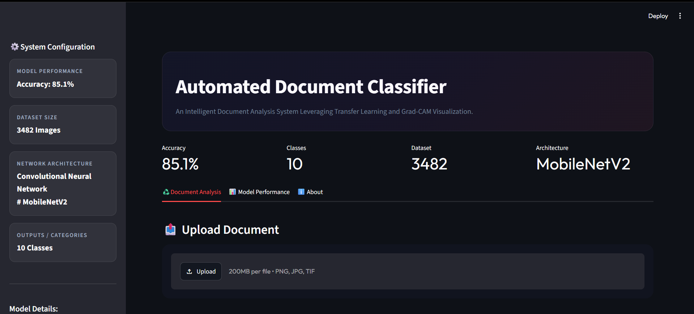

# Automated Document Classifier

A document image classification application built with PyTorch, MobileNetV2, and Streamlit.
It predicts one of ten document categories from an uploaded image and provides a Grad-CAM visualization.
Classification uses image pixels without a separate OCR stage; the model can learn layout, typography, shapes, logos, and other visual features.

## Project Overview

Upload a scanned document image to obtain its predicted category, the two highest softmax class scores, and a Grad-CAM overlay. The interface also displays saved training and evaluation artifacts. The project demonstrates transfer learning and document image classification for an industrial training presentation.

## Problem Statement

Scanned documents often need to be categorized before they can be organized or retrieved. This project explores predicting document categories directly from images rather than first extracting their text.

## Features

- Classification into ten document categories with MobileNetV2.
- Shared 384×384 preprocessing for validation, evaluation, and application inference.
- Grad-CAM overlay with Original, Grad-CAM, and Compare views.
- Streamlit upload interface and top-two class scores.
- Training with ImageNet initialization and class-weighted cross-entropy.
- Evaluation code for precision, recall, F1, confusion matrices, and precision-recall curves.
- Included historical evaluation plots and training history.

## Document Classes

ADVE (Advertisement), Email, Form, Letter, Memo, News, Note, Report, Resume, and Scientific.
These names and their order match `models/class_mapping.json` and the supplied ten-output checkpoint.

## Dataset

**Tobacco3482** is a document image classification benchmark containing **3,482 scanned images in ten categories**, sampled from IIT-CDIP, whose documents originate from the Truth Tobacco Industry Documents collection. The count and categories are independently described in [Label Errors in the Tobacco3482 Dataset](https://arxiv.org/abs/2412.13140).

Download the JPG dataset from [Kaggle](https://www.kaggle.com/datasets/patrickaudriaz/tobacco3482jpg). The dataset and original split manifest are **not included**. Inference with uploaded images only needs the supplied model and mapping.

For future training, organize the images as follows, using these exact folder names:

```text
data/
└── Tobacco3482/
    ├── ADVE/
    ├── Email/
    ├── Form/
    ├── Letter/
    ├── Memo/
    ├── News/
    ├── Note/
    ├── Report/
    ├── Resume/
    └── Scientific/
```

Each class folder must contain supported images directly: PNG, JPG, JPEG, TIF, TIFF, or BMP. A nested archive extraction is detected, but the selected class-folder directory must contain exactly the ten expected classes. Training checks every image before starting. Unreadable images raise an error; they are never replaced with fabricated blank images.

The dataset is small, imbalanced, and contains label ambiguities documented in the linked research. Local class counts are printed during training; no unverified per-class distribution is assumed.

## System Workflow

```text
Document image → RGB conversion → Resize to 384×384
→ ToTensor → ImageNet normalization → MobileNetV2 features
→ Global average pooling → Dropout(0.2) → Linear(1280, 10)
→ Ten logits → Softmax scores → Predicted class
→ Grad-CAM for the selected class → Streamlit output
```

Grad-CAM performs a separate forward/backward pass after prediction. It is an explanation stage, not an extra classifier.

## Model Architecture

Training initializes MobileNetV2 with TorchVision's ImageNet weights (`IMAGENET1K_V2`). Feature parameters in blocks **0–13** are frozen; blocks **14–18** and the replacement classifier are trainable. BatchNorm running statistics still adapt during training. Global average pooling produces 1280 features, followed by dropout with probability 0.2 and `Linear(1280, 10)`.

The application constructs the same architecture and loads the complete local state dictionary strictly. It does not download pretrained weights for inference. CUDA is selected when available; otherwise the code uses CPU.

## Preprocessing

Validation, test evaluation, and uploaded-image inference use identical processing:

1. Convert the image to RGB.
2. Resize to **384×384**; this stretches the original aspect ratio.
3. Convert to a tensor with pixel values scaled to [0, 1].
4. Normalize channels with mean `[0.485, 0.456, 0.406]` and standard deviation `[0.229, 0.224, 0.225]`.

Training additionally applies random horizontal flipping and rotation up to ±10°. These augmentations are absent from validation and test processing.

## Training Configuration

| Setting | Value |
|---|---|
| Model | MobileNetV2 |
| Initialization | ImageNet pretrained weights |
| Split | Approximately 80% train / 10% validation / 10% test, stratified |
| Loss | Weighted CrossEntropyLoss |
| Class weights | Inverse class frequency, computed from training labels only |
| Optimizer | Adam |
| Initial learning rate | 0.0001 |
| Batch size | 32 |
| Epochs | 12 |
| Scheduler | ReduceLROnPlateau on validation loss; factor 0.5, patience 2 |
| Checkpoint selection | Best validation accuracy |
| Random seed | 42 for future runs; exact cross-platform equality is not guaranteed |

The cleaned training code sorts input paths and aggregates weighted loss using target-weight denominators. These changes apply to future runs; the historical artifacts remain unchanged.

## Evaluation Results

**The saved evaluation artifacts included with the project report the following results.** They were not newly reproduced during cleanup. The original dataset and matching split manifest are needed to independently evaluate the supplied checkpoint on its original test set.

| Metric | Saved result |
|---|---:|
| Test accuracy | 85.10% |
| Macro F1 | 84.13% |
| Weighted F1 | 85.09% |
| Final training accuracy | 86.78% |
| Final validation accuracy | 79.94% |

The saved confusion matrix contains **297 correct predictions out of 349 test images**, consistent with the reported accuracy and F1 scores. Twelve epochs are recorded in `models/training_history.json`.

## Per-Class Performance

| Class | Precision | Recall | F1 | Test support |
|---|---:|---:|---:|---:|
| ADVE | 0.9583 | 1.0000 | 0.9787 | 23 |
| Email | 0.9516 | 0.9833 | 0.9672 | 60 |
| Form | 0.9394 | 0.7209 | 0.8158 | 43 |
| Letter | 0.8772 | 0.8772 | 0.8772 | 57 |
| Memo | 0.8060 | 0.8710 | 0.8372 | 62 |
| News | 1.0000 | 0.9474 | 0.9730 | 19 |
| Note | 0.7619 | 0.8000 | 0.7805 | 20 |
| Report | 0.7000 | 0.7778 | 0.7368 | 27 |
| Resume | 0.9091 | 0.8333 | 0.8696 | 12 |
| Scientific | 0.5769 | 0.5769 | 0.5769 | 26 |

ADVE, News, and Email have the strongest saved F1 scores. Scientific is weakest. The matrix shows Scientific being predicted as Letter, Memo, and Report in three cases each; the cause cannot be established from the matrix alone. Small class supports limit how broadly these results can be generalized.

## Grad-CAM Explainability

Grad-CAM uses activations and gradients from the final MobileNetV2 feature block to estimate regions with positive contributions to the selected class score. Its 12×12 map is resized and blended with the document for display. Warm colors indicate larger normalized contributions within that image.

The overlay is an approximate visual explanation. It does not establish semantic understanding, and color intensities should not be compared as absolute importance across images.

## Streamlit Application

Upload a PNG, JPEG, or TIFF image → view the predicted category and class scores → compare the document with its Grad-CAM overlay. The Model Performance tab shows existing report assets; the About tab explains the implementation and limitations.

Uploads are limited to 20 MB and 20 million pixels; only the first TIFF frame is processed. Invalid files and missing resources produce concise messages. There is no built-in sample selector or PDF support. The model is cached, but visualization changes currently rerun inference.



The copied screenshots are historical examples. Their older confidence/layout wording differs from the corrected application.

## Project Structure

```text
project/
├── src/
│   ├── app.py
│   ├── train.py
│   ├── evaluate.py
│   └── utils.py
├── models/
│   ├── document_classifier.pth
│   ├── class_mapping.json
│   └── training_history.json
├── reports/
│   ├── confusion_matrix.png
│   ├── precision_recall.png
│   ├── training_curves.png
│   └── evaluation_report.md
├── assets/
│   ├── dashboard.png
│   └── prediction&Grad-CAM.png
├── presentation_outputs/
│   ├── training_curves.png
│   ├── confusion_matrix.png
│   ├── precision_recall.png
│   ├── dashboard.png
│   ├── prediction_gradcam.png
│   ├── results_summary.md
│   └── presentation_notes.md
├── environment.yml
├── requirements.txt
├── run.bat
├── .gitignore
└── README.md
```

## Installation

Recommended: **Conda with Python 3.11**. From the project directory:

```bash
conda env create -f environment.yml
conda activate document-classifier
streamlit run src/app.py
```

The environment installs the pinned dependencies from `requirements.txt`, including the matching PyTorch 2.5.1 / TorchVision 0.20.1 pair. Use this environment rather than the existing Python 3.13 installation.

Optional pip setup with Python 3.11:

```bash
python3.11 -m venv .venv
source .venv/bin/activate
python -m pip install -r requirements.txt
python -m streamlit run src/app.py
```

On Windows, activate with `.venv\Scripts\activate` instead. `run.bat` launches using the active environment. Scripts resolve resources relative to the project, so an absolute script path also works from another directory.

After installation, uploaded-image inference uses local resources. Initial installation and the first download of ImageNet weights for new training require internet. The optional Google font may fall back to a local font offline.

## Training the Model

Training is optional for this presentation; the supplied checkpoint is ready for inference.

1. Download and arrange the dataset as described above.
2. Activate `document-classifier`.
3. Run:

```bash
python src/train.py
```

A new, initially empty `training_outputs/` directory receives the checkpoint, mapping, split manifest, and history. **The supplied files in `models/` are not replaced.** To conduct another run, choose a new directory with `python src/train.py --output-dir training_outputs_2`.

## Evaluation

To evaluate a new training run using its matching test split:

```bash
python src/evaluate.py --run-dir training_outputs
```

New plots and a report are written to `evaluation_outputs/`, preserving `reports/`. Use `--output-dir` to choose another output directory.

For the supplied checkpoint, first restore its original manifest to `data/splits.json` and its corresponding images, then run `python src/evaluate.py`. The default evaluation cannot run with the current missing dataset/manifest. Generating a new random split does not establish a valid held-out test set for existing weights.

## Limitations

- Only ten known classes; every input receives one of them.
- Softmax scores are not calibrated confidence or guaranteed correctness.
- Small, imbalanced dataset with label ambiguities; results depend on data quality.
- New document styles and scanning conditions may reduce accuracy.
- Square resizing changes aspect ratio.
- Grad-CAM gives coarse, approximate visual explanations.
- Historical results lack the original split manifest in this workspace.
- Image-level splitting does not check duplicates or group related document pages.

## Future Improvements

Larger and more representative datasets, better document augmentation, duplicate-aware splitting, unknown-document detection, calibrated confidence, comparisons with other CNNs, and a small record of experiment settings and splits.
